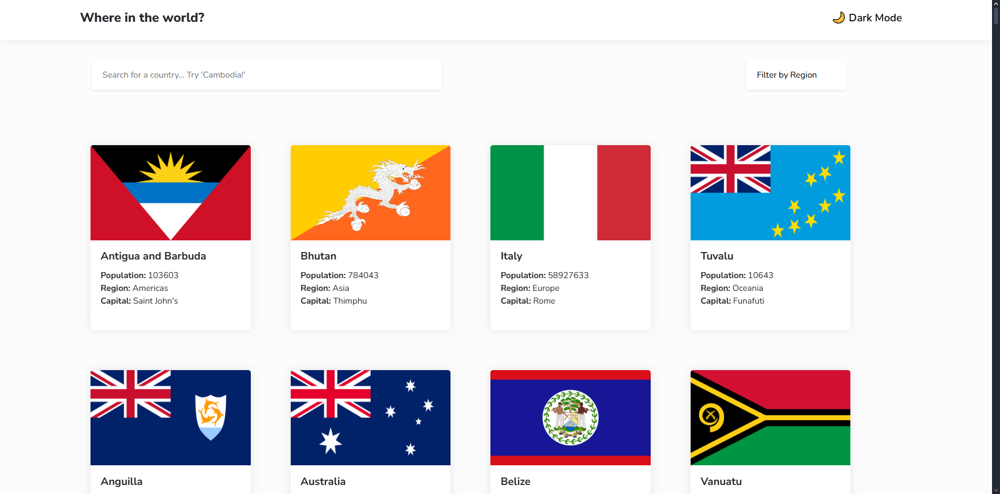
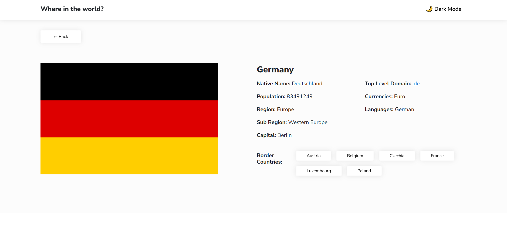
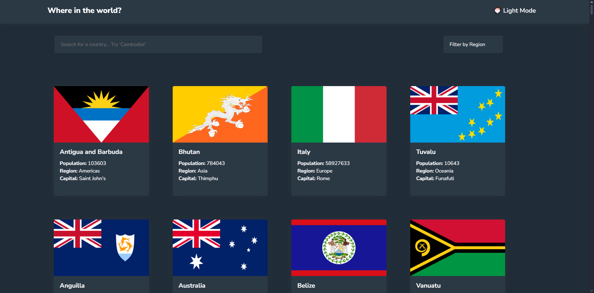
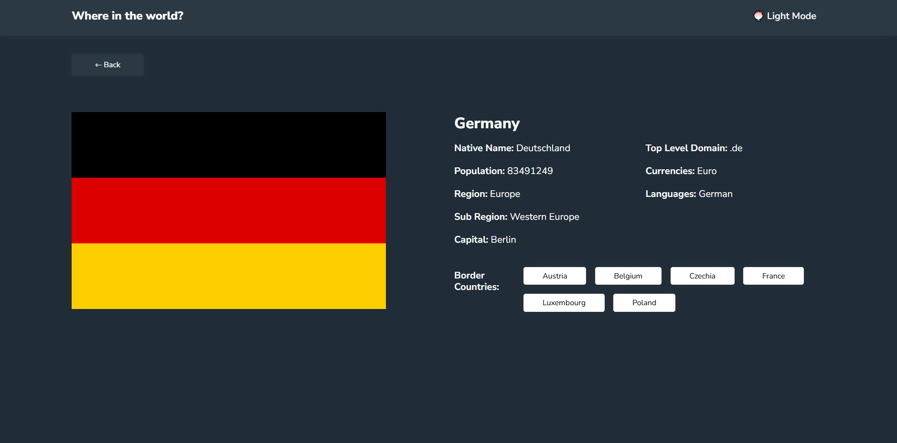
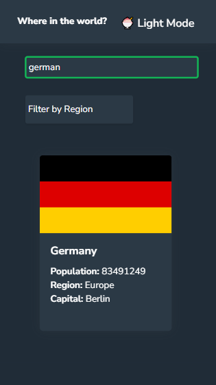
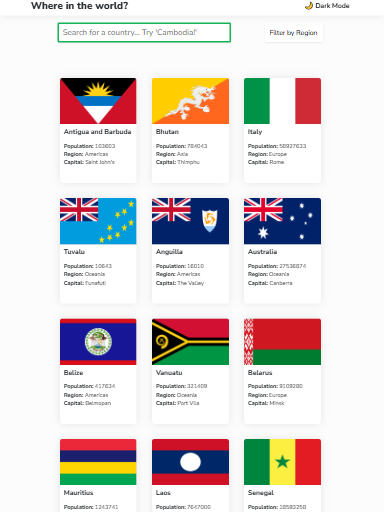

# Where in the World? 🌎
## Overview
This is a solution to the [REST Countries API with color theme switcher challenge on Frontend Mentor](https://www.frontendmentor.io/challenges/rest-countries-api-with-color-theme-switcher-5cacc469fec04111f7b848ca). Additionally, this project aims to assess my ability to apply the skills and knowledge acquired throughout the MERN Stack course in a practical, real-world scenario. 

------------------------------------------------
## Table of contents

- [Overview](#overview)
  - [GitHub](#github)
  - [The challenge](#the-challenge)
  - [Link to Website](#view-live-website)
  - [Previews](#previews)
  - [My process](#my-process)
  - [Built with](#built-with)
  - [Reflection Questions](#reflection-questions)
  - [Useful resources](#useful-resources)
- [Author](#author)

### GitHub Link
https://github.com/ANIO-Official/where-in-the-world 
### The challenge

Users should be able to:

- See all countries from the API on the homepage
- Search for a country using an `input` field
- Filter countries by region
- Click on a country to see more detailed information on a separate page
- Click through to the border countries on the detail page
- Toggle the color scheme between light and dark mode *(optional)*

### View Live Website

### Previews
DESKTOP | LIGHT MODE

DESKTOP | DARK MODE

MOBILE

TABLET

## My process
Quick brief about process. Here are my steps/general steps:
 1. Git init.

  - git init in bash terminal within VSCode.

 2. Semantic HTML Format & Layout/Frame Setup

  - Look at the design images provided by Frontend Mentor and breakdown the different parts necessary to create the pages.
  - Create the basic structure of the HTML page.
  - Use Semantic HTML tags for ease of reading for Assistive Technologies.

 3. Make it Responsive

  - Link Bootstrap CSS Library to document.
  - Use Bootstrap grid utility classes: row, col, row-col & breakpoints to create a responsive grid layout.
  - Add necessary height and width adjustments as necessary for breakpoints in CSS media queries.
  - Test the responsiveness of the page within Google Chrome Dev tools.
  - Adjust measurements and utility class placment as necessary.

 4. Style the basic inital parts with placeholders.

  - Create a card template. Use a plan gray colored background to help with sizing the placeholder area of flag.
  - Use the Bootstrap Card component to create an easy card layout for a template to later clone in the JS code.
  - Adjust Bootstrap Card component styling in CSS to match the design style.
  - Link font required by Frontend mentor challenge, apply to body in CSS.

 5. CSS Accessibility Styling & A Custom CSS Properties 

  - Create and apply custom color and sizing properties at :root in CSS based on provided design details.
  - Add focus & hover states for interactive areas such as inputs, selects, and buttons.

 6. Filter & Search

  - Adjust Styling of Search Bar, change type to "search", and follow proper Accessibility html tags by wrapping inside html 'search' tag.
  - Adjust Styling of Filter Select

 7. TypeScript (Ultimately Removed and Refactored into one JS file due to scope)

  - Originally, I coded this app with TypeScript(TS) modules, however upon trying to compile to JS code and perform DOM Manipulation, I ran into many issues that would push the project out of scope due to my current understanding of TS in relation to DOM Manipulation. As TypeScript is *not* the focus of this project, I decided to reorganize and refactor my code to a single JavaScript(JS) file. It took about an hour or less of time, and it was 100% worth it for now. 
  - I will have to look more into TS's handling of DOM manipulation to handle proper typing. I did read TypeScript's documentation on the DOM, but I found myself misunderstanding how to manipulate it properly while typing variables and functions returns.
  - Since I am confident in DOM manipulation in Javascript, I decided to pivot to this method instead.

 8. JavaScript

  - Cache Global DOM Variables
  - Create array variables to hold object data fetched from REST Countries API.
  - Create CountryCard Class
  - Create custom Error sub Classes for error handling.
  - Fetch Request to API using async/await functions, returning the variable containing the object data for all countries from the API. fetchCountries for fetching the main data, fetchCountryCodes to fetch specifically the country cioc codes (and names for easy filter matching).
  - Create asynchronous renderCards() to await for fetched data, create an CountryCard object for each country, push each CountryCard object into the cardsData array, call createFragment() that accepts an array as a parameter and creates list items of card components to display in the cards batch (unordered list) based on the template previously made in step 4.
  - Add Filter & Search functionality by filtering the cardsData array to return CountryCard objects by region selected or search terms typed into the search bar, and calling createFragment() to display/re-render them.
  - Create Detailed Screen and utility functions to call to find and display the country's details.
  - Add event listeners to:

    1. Document to load all countries on DOMContentLoaded (renderCards())
    2. Country search bar to dynamically show matching countries containing the query on keydown (searchForCountry()).
    3. Region Filter Select to dynamically show matching countries of the same region on change of option (filterByRegion())
    4. The cards batch (unordered list) for event delegation. Control whenever any card (li)'s image or title is clicked, that the detailed view appears for them specifically.
    5. The country detailed view page for event delegation. When back is clicked, hide this screen and return (show) the main screen with all countries (toggleMainScreen()). When a border country is clicked, show their details instead (showDetails()).

 9. Test, BugFix, Adjustments

  - Test the HTML file in the chrome or chromium browser.
  - Fix bugs such as visual errors with CSS and dynamic elements.
  - Add 'col' utility class to dynamic card component list items.
  - Add hover states and aria-labels to cards and border countries to clarify they can be clicked.
  - Ensure errors appear in console and alerts to users by forcing and testing for an error message. 
  Add try/catch and async/await where needed.
  - Separate fetch request for ciocs due to 10 field limit with API url.

 10. Touch ups

  - Overall styling adjustments.
  - Adjustments to include tablet sized device responsive layout.
  - Check and adjust mobile layout to fix any visual bugs.

 11. Dark mode toggle

  - Create CSS .dark class styling for applicable areas.
  - Create functions toggleTheme() and setTheme() to properly update elements on press of toggle button and when items are dynamically created by the filter and search.

### Built with
- JavaScript
- Semantic HTML
- CSS
- BootStrap/Other CSS Libraries
- TypScript

## Reflection

 

### Useful resources

- [Name](link) - Description/comment

## Author

- LinkedIn - [Amanda Ogletree](https://www.linkedin.com/in/amanda-ogletree-a61b60168)